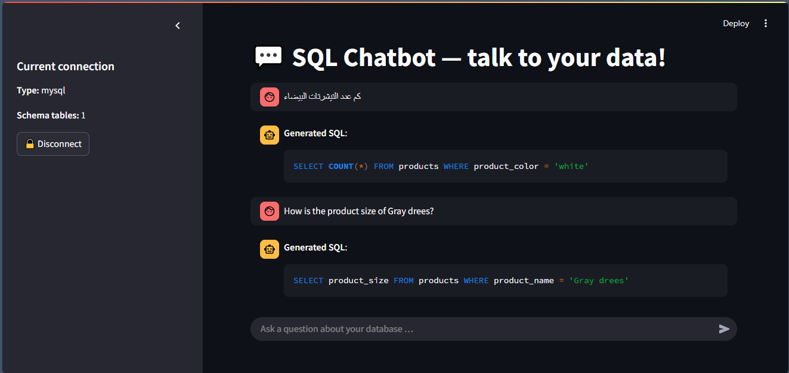

# Fine-tuning Google Gemma 3B on Synthetic Text-to-SQL Dataset


## 📚 Overview

This project fine-tunes **Google's `gemma-3-1b-it` model** on the **GretelAI `synthetic_text_to_sql` dataset**.

- Fine-tuning Notebook: [Open in Colab](https://colab.research.google.com/drive/1mRYAVqm9VPc0rZ9TTKDpFi_falj_QB6_?usp=sharing)

Then we build a system to **chat in natural language with your database** using the fine-tuned model:
- Connects to your database
- Reads the database schema
- Translates natural language questions into SQL queries
- Executes the queries
- Displays the results immediately

---

## 🗈️ System Interface Example




---

## 🚀 How to Run

Follow these steps to run the SQL Chatbot System on your local machine:

### 1. Create a Virtual Environment

Open your command line (Command Prompt or Terminal) and run the following command to create a new virtual environment:

```bash
conda create --name SQLChatbotSystem python=3.10 -y
```

### 2. Activate the Virtual Environment

Activate the virtual environment using the command appropriate for your operating system:

```bash
conda activate SQLChatbotSystem
```

### 3. Clone the Repository

Once the environment is activated, clone the repository using the following command:

```bash
git clone [repository_link]
```

Replace [repository_link] with the actual link to your Git repository.

### 4. Install Requirements

Ensure you are inside the cloned repository folder, then install the required libraries:

```bash
pip install -r requirements.txt
```

Or you can manually install the libraries like this:

```bash
pip install streamlit pandas psycopg2-binary mysql-connector-python google-genai json-repair
```

### 5. Run the Application

After installing the requirements, you can run the Streamlit application using the following command:

```bash
streamlit run streamlit_sql_chatbot_app.py
```

This will open a window in your web browser displaying the SQL Chatbot interface.

Now, you're all set to use the SQL Chatbot System! If you encounter any issues, feel free to reach out for help.

---

## 📚 Files Structure

| File | Purpose |
|:----|:--------|
| `connect_database.py` | Connects to different databases and extracts schema |
| `text2sql.py` | Converts natural language to SQL using Gemini API |
| `streamlit_sql_chatbot_app.py` | Streamlit web app for user interaction |

---

## ⚙️ How the System Works

1. **Connect to your database** via a simple form.
2. **Supported database types**:
   - SQLite
   - PostgreSQL
   - MySQL / MariaDB
3. **Ask your question** in natural language.
4. The app:
   - Extracts your **schema** automatically
   - Sends your question + schema to the **fine-tuned LLM**
   - Receives a **SQL query** back
   - Executes the SQL query directly on your database
   - Displays the **results** in real-time
5. **Chat history** is maintained for a continuous conversation experience.

---

## 🧹 Example Chatbot Screenshot

Here's a full interaction flow:


---

## 💬 Key Features

- 🔌 Simple database connection from UI
- 🤖 Natural language to SQL conversion using fine-tuned LLM
- ⚡ Fast and real-time SQL execution
- 💃 Supports multiple SQL databases (PostgreSQL, MySQL, SQLite)
- 🌟 Clean and modern chat interface
- 🧪 Smart schema extraction

---

## 📜 License

This project is released under the MIT License.

---

# ✨ Enjoy querying your database using only natural language! ✨

